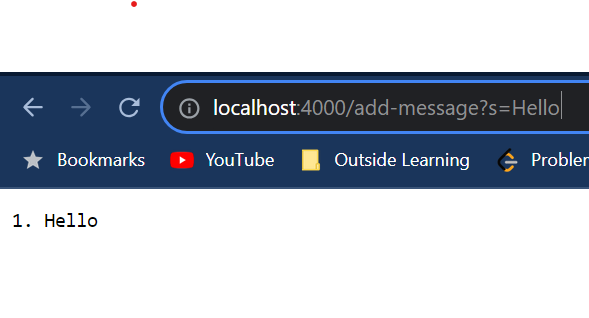
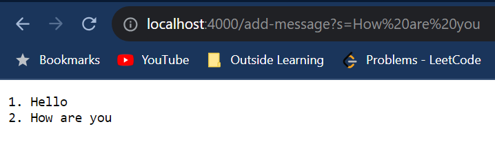
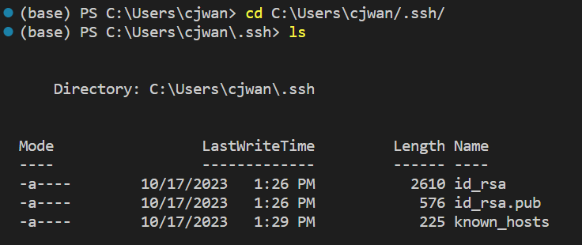
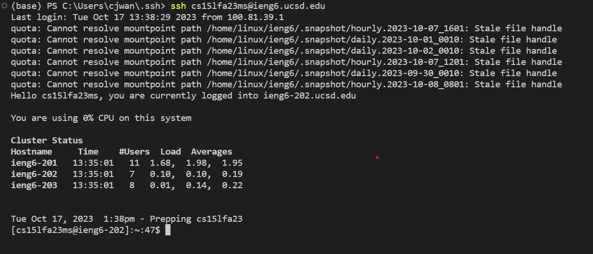

# Week 3: Lab Report 2
## Part 1: String Server
### Code:
```
import java.io.IOException;
import java.net.URI;
import java.util.ArrayList;

class Handler implements URLHandler {
    // The one bit of state on the server: a number that will be manipulated by
    // various requests.
    ArrayList<String> arr = new ArrayList<>();

    public String handleRequest(URI url) {
        if (url.getPath().equals("/add-message")) {
            String[] parameters = url.getQuery().split("=");
            if (parameters[0].equals("s")) {
                arr.add(parameters[1]);
            }
            StringBuilder s = new StringBuilder();
            for (int i = 0; i < arr.size(); i++) {
                s.append((1 + i) + ". " + arr.get(i) + "\n");
            }
            return s.toString();
        } else {
            return "404 Not Found!";
        }
    }
}

class StringServer {
    public static void main(String[] args) throws IOException {
        if(args.length == 0){
            System.out.println("Missing port number! Try any number between 1024 to 49151");
            return;
        }

        int port = Integer.parseInt(args[0]);

        Server.start(port, new Handler());
    }
}
```


- Excluding the work that is done by `Server.java`, there is only one method in my code that gets called, which is `HandleRequest` inside of the class `Handler`.
- The relevant argument that gets passed to the method `HandleRequest` will be the url as a Java `URI`, so in this case a `new URI(http://localhost:4000/add-message?s=Hello)`. There is only one class field for the class, which is an `ArrayList<String>` called `arr`, which starts out empty.
- After this `HandleRequest` is called, `arr` will now contain one `String` `"Hello"`. 

- Excluding anything done by `Server.java`, the only method that is called is `HandleRequest` from class `Handler`.
- The relevant argument that gets passed to the method `HandleRequest` will be the url as a Java `URI`, so in this case a `new URI(http://localhost:4000/add-message?s=How%20are%20you)`. There is only one class field for the class, which is an `ArrayList<String>` called `arr`, which starts out containing one `String`, `"Hello"`.
- After this call of `HandleRequest` is called, `arr` will now contain two `Strings`, `"Hello"` and `"How are you"`.

## Part 2: SSH Key

- The path to the private ssh key is `C:\Users\cjwan\.ssh\id_rsa`
- The path to the public ssh key is `/home/linux/ieng6/cs15lfa23/cs15lfa23ms/.ssh/authorized_keys`


## Part 3

Over the coures of weeks 2 and 3 I learned a lot about how to remotely access another computer. Prior to these 2 weeks, my understanding of how the internet worked was quite vague, but now understanding how ssh connects one computer to another, the idea of servers makes much more sense to me. Hosting various websites on a single server and then connecting different computers to the locally hosted content, gives me the fundamentals necessary to have a foundational understanding of how websites work. 
