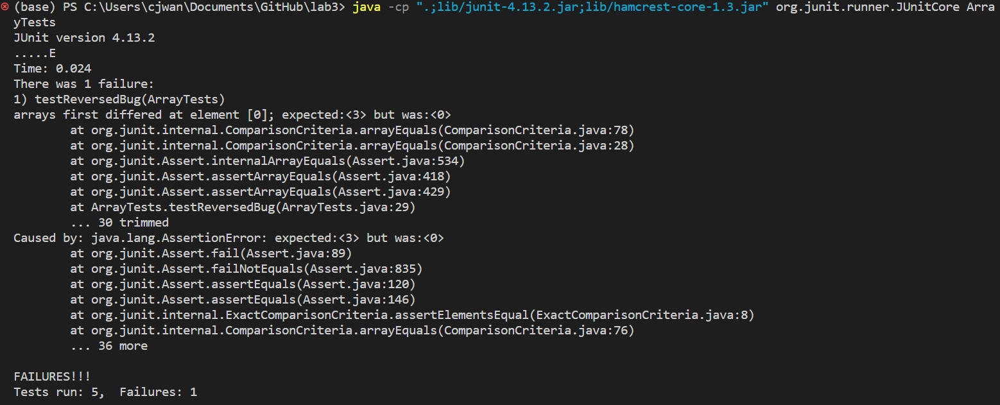

# Week 5: Lab Report 3
### Colin Wang
## Part 1 - Bugs:
- For the `reversed` method in `ArrayExamples.java` this is a failure-inducing input:
```
@Test
public void testReversedBug() {
    int[] input = {1, 2, 3};
    assertArrayEquals(new int[]{3, 2, 1}, ArrayExamples.reversed(input));
}
```
- For the `reversed` method in `ArrayExamples.java` this is an input that does not cause a failure:
```
@Test
public void testReversed() {
    int[] input1 = { };
    assertArrayEquals(new int[]{ }, ArrayExamples.reversed(input1));
}
```
- Here is the output of the JUnit tests for these two: 
- Here is the original code with bug:
```
static int[] reversed(int[] arr) {
    int[] newArray = new int[arr.length];
    for(int i = 0; i < arr.length; i += 1) {
      arr[i] = newArray[arr.length - i - 1];
    }
    return arr;
}
```
- Here is the code with the bug fixed:
```
static int[] reversed(int[] arr) {
    int[] newArray = new int[arr.length];
    for(int i = 0; i < arr.length; i += 1) {
      newArray[i] = arr[arr.length - i - 1];
    }
    return newArray;
}
```
  This fixes the code because it actually uses the new array that is created to store the values in reverse. The original code only instantiates a new array, but then modifies and returns the original, which causes the incorrect behavior.

## Part 2 - Researching Commands:
# documentation for grep command options retrieved from [linuxcommand.org](https://linuxcommand.org/lc3_man_pages/grep1.html)
1. -r is an option for grep that recursively searches for the phrase under each directory.
- Example 1:  
`grep -r "base pair" technical/biomed`
```
a lot of lines
technical/biomed/gb-2002-3-12-research0083.txt:            hundred base pairs, and the separation can be as much
technical/biomed/gb-2002-3-6-research0029.txt:          micro-exons, ranging from 3 to 25 base pairs (bp) in
technical/biomed/gb-2003-4-4-r24.txt:        important considering that within a few hundred base pairs,
technical/biomed/rr196.txt:          approximately 500 base pairs upstream of the stop codon,
```
This command goes to recursively find the instances of the phrase "base pair" within the technical/biomed sub directory. This can be useful if you just want to specify a directory to go through to find the matching phrase.
- Example 2:  
`grep -r "base pair" technical/plos > grep-plos.txt`  
`no output`  
This command gives no output because it instead redirects the outputs into a file called `grep-plos.txt`. This is very useful because we can then use other linux commands on the file like `wc`, instead of looking at a mass text output.
2. -i is an option for grep that will ignore case when searching for a phrase.
- Example 1:  
`grep -i "Base pair" technical/biomed/*.txt`  
```
a lot of lines
technical/biomed/gb-2002-3-12-research0083.txt:            hundred base pairs, and the separation can be as much
technical/biomed/gb-2002-3-6-research0029.txt:          micro-exons, ranging from 3 to 25 base pairs (bp) in
technical/biomed/gb-2003-4-4-r24.txt:        important considering that within a few hundred base pairs,
technical/biomed/rr196.txt:          approximately 500 base pairs upstream of the stop codon,
```  
This option allows us to find all variations of the phrase we are searching for excluding the case. This is helpful because most times we do not care about the case when searching for a phrase.
- Example 2:  
`input = "help"`  
`grep -i $input technical/plos/*.txt`  
```
a lot of lines
technical/plos/pmed.0020247.txt:        to survive. Public attitudes, stigma among them, help to sustain the entire unjust
technical/plos/pmed.0020247.txt:        these interventions will help people who are stigmatized to critique unjust societal
technical/plos/pmed.0020272.txt:        contributions such as the essay by Ioannidis to our magazine section that will help
technical/plos/pmed.0020281.txt:        forces that zealously guard their secrets could not have been told without the help of
```  
This use of -i allows us to take user input and not care about the case of the input which can be helpful if the user is unaware of the case sensitive nature of grep, especially if we are using this in a bash script.
3. -n is an option for grep that will print the line number of the match of the phrase when printing out the found phrases.
- Example 1:  
`grep -n "base pair" technical/biomed/gb-2002-3-12-research0079.txt`  
```
231:          98.7% of the base pairs are contained within 100-kb
554:          and the total number of base pairs involved in those
```  
This can be useful if we are trying to use grep similarly to ctrl+f, since this now has the line numbers where the searched phrase appears in the file, allowing us to see the context it is used in.
- Example 2:  
`grep -n "base pair" technical/biomed/*.txt`  
``` 
a lot of lines
echnical/biomed/gb-2002-3-12-research0079.txt:554:          and the total number of base pairs involved in those
technical/biomed/gb-2002-3-12-research0083.txt:740:            hundred base pairs, and the separation can be as much
technical/biomed/gb-2002-3-6-research0029.txt:136:          micro-exons, ranging from 3 to 25 base pairs (bp) in
technical/biomed/gb-2003-4-4-r24.txt:36:        important considering that within a few hundred base pairs,
technical/biomed/rr196.txt:200:          approximately 500 base pairs upstream of the stop codon,
```
Here we can see the line number that the phrase appears on for the file show up at the end. Having the line number for all of these points allows us to quickly find where the phrase shows up in multiple files.
4. -c option for grep command gives the count of matches within files.
- Example 1:  
`grep -i -c "the" technical/biomed/gb-2002-3-12-research0079.txt`  
`509`  
This option here allows us to quickly find the total number of instances of a specific phrase inside of a file which maybe what we want. This allows us to avoid having to use another command, like using `wc`, or time to find the total occurences of the matched phrase within a file.
- Example 2:  
`grep -r -c "the" technical/biomed`
```
a lot of lines
technical/biomed/rr196.txt:247
technical/biomed/rr37.txt:147
technical/biomed/rr73.txt:85
technical/biomed/rr74.txt:102
```
This option provides us with the total count of the searched phrase within every file in a directory. This can be helpful if we want to compare the number of matches within multiple files.