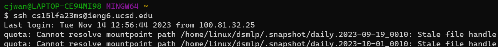
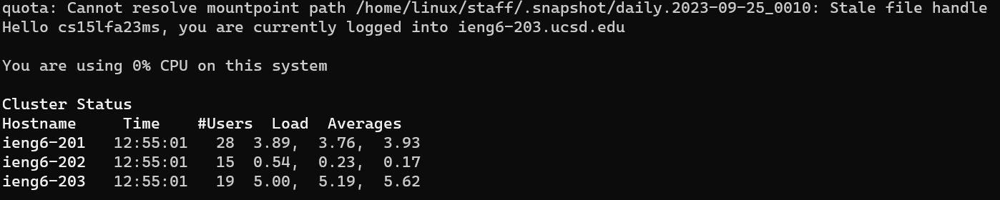
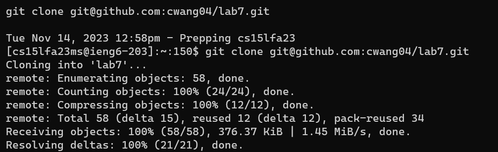
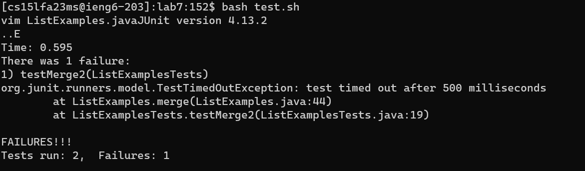
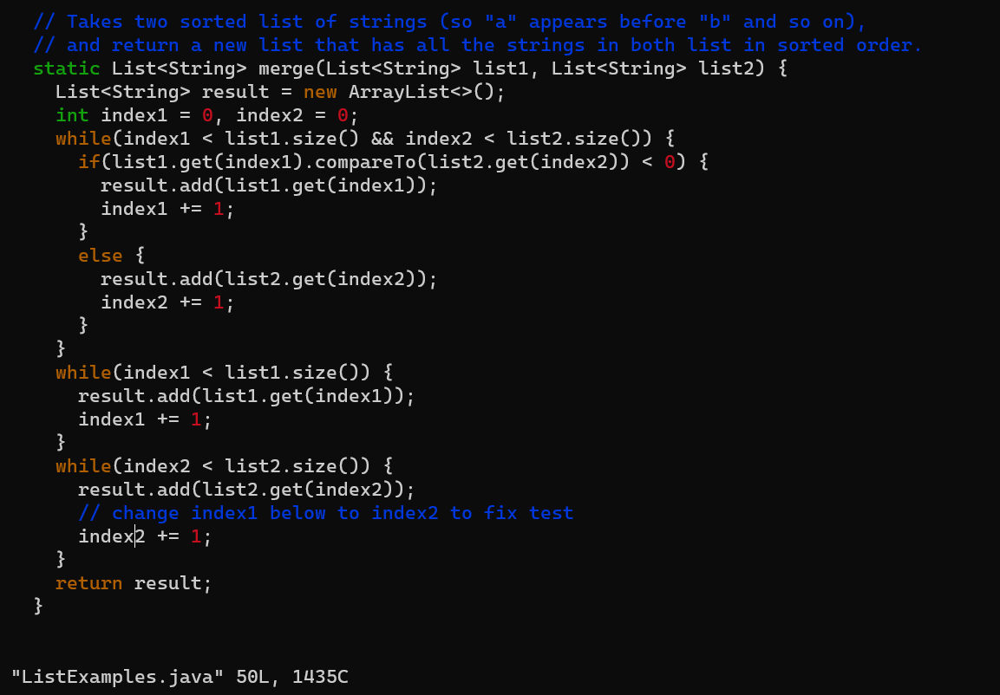
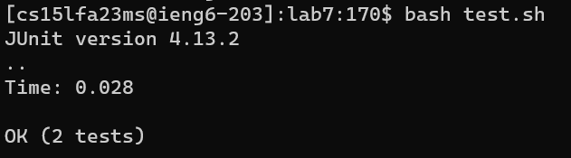

# Week 7: Lab Report 4 Vim
### Colin Wang
## Vim Editting
### Step 4: Logging into `ieng6`

- Key Input: `<up><enter>`
- Explanation:
To quickly log into `ieng6`, since we had previously been connected to `ieng6` in order to practice Vim, it was the last command on my local bash terminal, meaning I could press `<up>` to access it since it was the last command, and then press `<enter>` to quickly access to remote machine.
### Step 5: Cloning fork from GitHub

- Key Input: `git clone Ctrl-v<enter>`
- Expanation:
While the terminal was connecting to `ieng6`, I was on the repository page of my GitHub, where I copied the ssh key by clicking the two square icons next to the ssh key. Then I went back to the terminal and typed the command `git clone` then pressed `Ctrl-v` to clone the repository into `ieng6`.
### Step 6: Running the Tests, Demonstrating Failure

- Key Input: `cd l<tab>` `bash t<tab>`
- Explanation: 
To run the tests, I navigated to the cloned repository by typing `cd l<tab>` The tab auto-completed to `lab7`, since it was the only directory that started with an l. Then the next step was to run the auto grader provided, which I did by typing `bash t<tab>`, again auto-completing to the only file that started with a t.
### Step 7: Vim Editing

- Key Input: `vim L<tab>.java` `43jei<delete>2<escape>:wq<enter>`
- Explanation:
To open Vim, I typed the command `vim` followed by `L<tab>`, which autocompleted to `ListeExamples`, then I added `.java` to ensure that it opened the java file. Then I needed to navigate in Vim, which I used the command above to move down 43 lines, go to the end of the first word, enter insert mode, delete the last character, add a 2, go to normal mode, then finally save my edit and quit.
### Step 8: Running the Tests Again, Demonstrating Success

- Key Input: `<up><up><enter>`
- Explanation:
Since I had previously ran the bash script to autograde the file, I just needed to go back into my history to the point where I used it, which was only two command ago, thus I pressed `<up>` twice then `<enter>` to run the autograder again.
### Step 9: Committing and Pushing to GitHub

- Key Input: `git add .<enter>` `git commit<enter>` `ifixed error<escape>:wq<enter>` `git push`
- Explanation:
The first thing I had to do was add the changes I made to the local repository, which I did by typing `git add .`, the use of the `.` allowed me to not have to type out `ListExamples.java` since it added all the files in the repository even though only one file was changed. The next thing was to commit this add locally, so I typed the command `git commit<enter>`, which opened up a Vim editor. There I typed the commit message by typing `i` to enter insert mode, typing the commit message: `fixed error`, then saving and quitting by entering normal mode, press `<escape`, and then `:wq<enter>`. Finally I needed to push these changes to GitHub, which I did by typing `git push`.