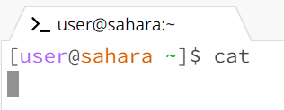

# __Lab Report 1__
Colin Wang
A17525730
## __`cd` Command Output__
1. `cd` with no given arguments:  
  
* The working directory at the start was `lecture1`.
* The output of running the `cd` command without a passed argument is that the directory changes to the root directory, which means that it navigates to the root directory.
* This output is not an error.
2. `cd` with path to a directory as given argument:  
  
* The working directory at the start was the root directory.
* The output of running the `cd` command with the passed argument as a path to a directory changed the working directory to the filepath of the name of the directory.
* The output is not an error.
3. `cd` with path to file as given argument:  
  
* The working directory at the start was `lecture1`
* The output of running the `cd` command with the passed argument as a path to a file causes an error to occur. The command line says `bash: cd: Hello.java: Not a directory`
* The output of this is an error because the `cd` command navigate to a directory and files are not directories

## __`ls` Command Output__
1. `ls` with no given arguments:  
  
* The working directory at the start was the root directory.
* The output of running the `ls` command with no passed argument just lists the contents of the root directory.
* The output is not an error.
2. `ls` with path to directory as given argument:  
  
* The working directory at the start was the root directory.
* The output of running the `ls` command with the path to a directory as an argument lists the contents of the passed directory.
* The output is not an error.
3. `ls` with path to file as given argument:  
  
* The working directory at the start was `lecture1/messages`.
* The output of running the `ls` command with the path to a file just causes it to print out the name of the file.
* The output is not an error.

## __`cat` Command Output__
1. `cat` with no given arguments:  
  
* The working directory at the start was the root directory.
* The output of running the `cat` command with no arguments causes it to wait and prompt the user to enter some sort of argument, as shown by it not calling the terminal line again.
* The output is not an error since it just waits for an input.
2. `cat` with path to directory as given argument:  
  
* The working directory at the start was the root directory.
* The output of running the `cat` command with no arguments is that it prints `cat: lecture1: Is a directory`.
* This is not an error.
3. `cat` with path to file as given argument:  
  
* The working directory at the start is `lecture1/messages`.
* The outupt of running the `cat` command with no arguments is that it prints out the contents of the passed file. `Hello Wêreld!`.
* This is not an error.

