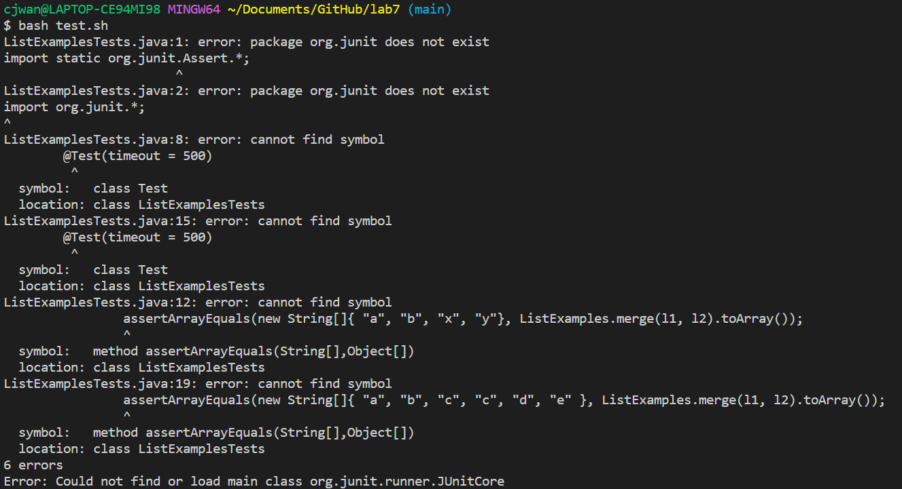
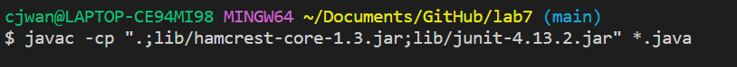
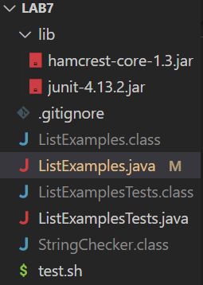

# Week 7: Lab Report 4 Vim
### Colin Wang
## Part 1: Debugging Scenario
### 1. Student:
When trying to test my code, `ListExamples.java` using JUnit testing in the file `ListExamplesTests.java`, through my bash script, `test.sh`, I keep encountering an error. `ListsExamplesTests.java` keeps having a compile error, stating ` package org.junit does not exist`. I'm not sure why this compile error keeps appearing, since there are no apparent errors in the code for `ListExamplesTests.java`. I've checked, and the `lib` folder contains the necessary packages for the code to compile, leaving me at a loss for what the error in my code is. Attached is a screenshot of the error message: 


### 2. TA:
Since this seems to be an error when you run the bash script to compile your files, have you tried to compile the code from the command line, and see if the files compile correctly, to determine where the bug is in your code. In case you don't remember how to, there is an example of compiling code for JUnit testing on week 4 of the website. Additionally, it would be helpful to me to provide the code for so that we can help you troubleshoot.

### 3. Student:
After running the compile command, `javac -cp ".;lib/hamcrest-core-1.3.jar;lib/junit-4.13.2.jar" *.java` from Week 4 on the command line, `ListExamples.java` and `ListsExamplesTests.java` both compiled, as shown in the image attached below. Thanks, I realized that the error is in `test.sh` and not in `ListExampleTests.java` like I originally thought. Looking through, `test.sh`, I realized that the bash script had the compile commands for Max/Linux systems, but my computer is running Windows, which is what caused the compile error. After changing the code to be compatible with Windows, `test.sh` now works as intended.


### 4.
* 
* `test.sh`: 
```
javac -cp .:lib/hamcrest-core-1.3.jar:lib/junit-4.13.2.jar *.java
java -cp .:lib/hamcrest-core-1.3.jar:lib/junit-4.13.2.jar org.junit.runner.JUnitCore ListExamplesTests
```

`ListExamplesTests.java`:
```
import static org.junit.Assert.*;
import org.junit.*;
import java.util.*;
import java.util.ArrayList;


public class ListExamplesTests {
	@Test(timeout = 500)
	public void testMerge1() {
    		List<String> l1 = new ArrayList<String>(Arrays.asList("x", "y"));
		List<String> l2 = new ArrayList<String>(Arrays.asList("a", "b"));
		assertArrayEquals(new String[]{ "a", "b", "x", "y"}, ListExamples.merge(l1, l2).toArray());
	}
	
	@Test(timeout = 500)
        public void testMerge2() {
		List<String> l1 = new ArrayList<String>(Arrays.asList("a", "b", "c"));
		List<String> l2 = new ArrayList<String>(Arrays.asList("c", "d", "e"));
		assertArrayEquals(new String[]{ "a", "b", "c", "c", "d", "e" }, ListExamples.merge(l1, l2).toArray());
        }

}

```
* `bash test.sh`
* edit the lines in `test.sh` so that the : are replaced with ;, and the paths are surrounded by quotation marks, this is only to get this piece of code working on Windows systems, if you are on linux or MacOS systems, the original `test.sh` should run with no errors.

## Part 2. Reflection
During the second quarter of this lab, I learned what Vim was and how to use it for the first time. Prior, to this part of the course, I had heard of jokes making fun of Vim and how it was difficult to use, but had never really looked into depth about what Vim really was besides a text-editor. During the labs focused on using Vim, I learned some of the commands and understood the general frustration and jokes aimed at Vim.